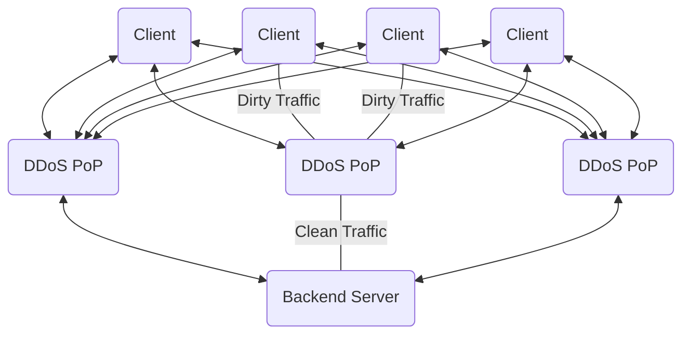

<Note>In Progress</Note>

# Introduction

To explain how NordHost protects its customers, we need to understand how DDoS Protection works.

At NordHost we utilize a large network of servers which are located all over the world in a Anycast configuration. This means that the client connects to the closest server to their geographical location. This will create the lowest amount of additional latency between the end user and the server. 

This large cluster acts as a middleman between your server and the client connecting and filters out malicious traffic, ensuring that only legitimate requests reach your server, thereby protecting it from DDoS attacks.

To understand this in a easier way we can look at the illustration below:

<Info>**PoP is a term for Points of Presence and refers to datacenters located all around the world**</Info>

This system distributes the traffic generated by legitimate clients and malicious clients, allowing a more redundant and powerful DDoS protection because the backend server will not be affected by the massive amount of dirty (malicious) traffic ensuring availablity and reliability for your legitimate clients.

<Note>
Are you interested in learning more?

Check out [Cloudflare's explaination](https://developers.cloudflare.com/ddos-protection/about/how-ddos-protection-works) or how our [provider explains it](https://docs.neoprotect.net/mitigation)
</Note>

